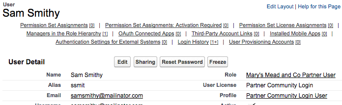
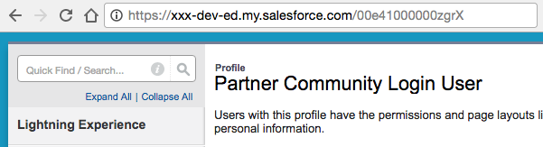
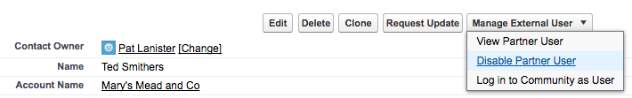

# DocuSign SFDC Recipe: Auto-provision Community Cloud Members

This repo contains a Python Flask application that demonstrates a Salesforce (SFDC) auto-provisioning use case:

* A company ("World Wide Corp") uses Salesforce Community Cloud to host their partner community.
* When a prospective partner wants to join World Wide Corp's partner program, they click on a "Join the Partner Program" link on the World Wide Corp website.
* The link opens a DocuSign PowerForm. The prospective partner enters their company name, their own name as the contact, and their own email.
* Using DocuSign, they review and then sign the partner agreement.
* DocuSign then routes the partner agreement to a specific contact in the Business Development (BizDev) department of World Wide Corp. Or the template could be set up to use a Signing Group. Eg, the agreement could be sent to all of the Business Development representatives.
* The BizDev rep reviews the agreement and approves it. 
* He looks up the new partner in Salesforce to see if they already have a partner entry. He creates one if they don't.
* He enters the SFDC partner url into the DocuSign envelope and signs it.
* This software application receives a notification from DocuSign, using the Connect webhook feature, that the envelope was signed. 
* Using the SFDC REST API, this application provisions the new partner in the World Wide Corp partner community. It first creates a contact record, then a partner community user record.
* The application sends an email that notifies the new partner that they can now generate a password and then login to the community.

## Installation

### Step 1. Set up the Salesforce Community

[Create and configure the partner community on Salesforce.](docs/create_sfdc_community.md) This step includes:

* Creating a Salesforce Developer Environment
* Installing DocuSign for Salesforce
* Configuring a Salesforce Partner Community

### Step 2. Create the DocuSign Powerform

[Create the Powerform on your DocuSign Developer account.](docs/create_powerform.md)

### Step 3. Install and run the app on Heroku

#### Install the software
1. Install a recent version of Python 2.x, 2.7.11 or later.
1. Install pip
1. Clone this repo to your computer
1. `cd` to the repo’s directory
1. `pip install -r requirements.txt` # installs the application’s requirements

#### Settings
The configuration file is app/ds_cache_defaults.py

In addition to usernames and passwords, it requires the **profile_id** from SFDC that will be used for new members of your community. The value is stored in the file, in field *sfdc_profile_id*.

To find the value:

* Open a Contact record for someone you have manually added to the community.
* Use the **Manage External User** dropdown menu and choose **View Partner User**
* The **User** detail page will open.
* Click the **Profile** field's link value. In this screenshot example, click on **Partner Community Login User**



* The detail page for the Profile will open. Make note of the last part of the url, the part that starts with 00e. That id is the profile id that you will add to the ds_cache_defaults file.



* Your SFDC security token is available from SFDC. At the top navigation bar go to your name > My Settings > Personal > Reset My Security Token. A new Security Token will be emailed to you.

* Obtain a free account from [www.mailgun.com](http://www.mailgun.com) It is used to send a welcome message to the new member of your community.

**Note: the ds_cache_defaults file requires your DocuSign and SFDC secret account authentication information. Don't allow the file to be stored in a git repo.**

#### Start the app on Heroku
1. Install the [Heroku Command Line Interface](https://devcenter.heroku.com/articles/heroku-command-line)
1. cd *your app install directory*
1. Choose a unique name for your auto provision app for use on Heroku. eg *your_initials*-sfdc-autoprovision. Eg xxx-sfdc-autoprovision
   The name of your Heroku server will be xxx-sfdc-autoprovision.herokuapp.com
   Your webhook listener address will be xxx-sfdc-autoprovision.herokuapp.com/webhook
1. Obtain a free or paid Heroku account if you don't have one.
1. set up your Heroku credentials for the Heroku Command Line Interface tools
1. run the command `./build_heroku.sfdc-recipe-auto-provisioning.sh .. xxx-sfdc-autoprovision`
   Add -force to over-write the staging directory.
1. The script will create a new staging directory for your auto-provision app on your machine, then run it on Heroku.
   Note that the lxml step takes several minutes since it requires a compilation of the source.

Record the webhook listener url. You'll use it in the next step.

#### Create a Connect web hook subscription

Create a Connect webhook subscription in your DocuSign Developer Account:

   1. Open the Admin tool.
   1. Choose Integrations / Connect from the left navigation list.
   1. Choose Add Configuration / Custom
   1. Fill in the form:
   1. Name: SFDC Auto-provision
   1. URL to publish: use the ngrok address plus "/webhook" Example: https://ff34aaaa.ngrok.io/webhook
   1. Enable log: check
   1. Require Acknowledgement: check
   1. Include -- check "Time Zone Information", "Sender Account as Custom Field", "Document Fields"
   1. Associated Users: choose the specific user who was set as the Powerform's sender.
   1. Trigger Events -- check just "Document Signed/Completed"
   1. Do not check any other entries
   1. Click Save
   
If you run the app locally, then you must enable the DocuSign event notification requests to reach your local machine--your *listener url* must be accessible from the Internet. Tools are available to enable this. Check with your infosec and IT departments before using them.   
   
## Test the app
* Fill in the PowerForm and sign it as the new partner. Use a valid email address.
* As the Business Development signer, log into DocuSign. You should see the envelope waiting for you to sign.
* Open the envelope and start the signing process. 
* As the Business Development signer, create or lookup a partner account in Salesforce for the new partner. 
* Enable the account as a partner account: Select "Enable As Partner" from the account's "Manage External Account" menu button.


* Copy the complete Salesforce url for the partner's acccount to the DocuSign envelope.
* Finish signing the envelope.
* Monitor the app's log. You should see log entries similar to:

```
### ### ### PowerForm sender (new partner): Jim Jones <jim.jones@example.com>
### ### ### Partner name: Jones Inc, SFDC partner url: https://testsite-dev-ed.my.salesforce.com/0016100000crviP
### ### ### ################## Starting SFDC provisioning
### ### ### Created contact for account 0016100000crviP!
### ### ### Created user record! ID = 00561000001viIBAAY
### ### ### ################## Completed SFDC provisioning
```

* The new partner should also receive an email with instructions on how to reset their password and login to the partner community.

## User Licensing Limits
Salesforce Developer Environment includes five user licenses for Partner Communities.

After you hit the limit, you'll need to delete some existing users if you wish to continue testing. 

To delete a user, you'll first disable their user record, then delete the contact.

* Search for the person, or use the Contacts tab to find them.
* Open their **Contact Detail** page. 
* First, delete their **User** record by using the **Manage External User** menu button. 
  Choose **Disable Partner User** and confirm.



* Then use the **Delete** button on the Contact page to remove the contact record.

### TLS issues
You may need to enable TLS 1.0 access to your SFDC Developer Environment if your Python installation does not support TLS 1.1. To do so:

* Click Settings, and enter "critical" in the Quick Find box. Select **Critical Updates**
* Deactivate the Critical Update "Require TLS 1.1 or higher for HTTPS connections"

Or better, upgrade your Python environment to the latest 2.7 release and libraries. 
This app *does* use TLS 1.1 correctly with Salesforce if the app's stack has been updated.

## Have a question? Pull request?
If you have a question about the Signature REST API, please use StackOverflow and tag your question with `docusignapi`

For bug reports and pull requests, please use this repo’s issues page.
