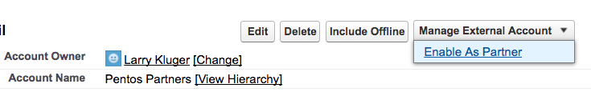

# DocuSign SFDC Recipe: Auto-provision Community Cloud Members

This repo contains a Python Flask application that demonstrates a Salesforce (SFDC) auto-provisioning use case:

* A company ("World Wide Corp") uses Salesforce Community Cloud to host their partner community.
* When a prospective partner wants to join World Wide Corp's partner program, they click on a "Join the Partner Program" link on the World Wide Corp website.
* The link opens a DocuSign PowerForm. The prospective partner enters their company name, their own name as the contact, and their own email.
* Using DocuSign, they review and then sign the partner agreement.
* DocuSign then routes the partner agreement to a specific contact in the Business Development (BizDev) department of World Wide Corp. Or the template could be set up to use a Signing Group. Eg, the agreement could be sent to all of the Business Development representatives.
* The BizDev rep reviews the agreement and approves it. 
* He looks up the new partner in Salesforce to see if they already have a partner entry. He creates one if they don't.
* He enters the SFDC partner url into the DocuSign envelope and signs it.
* This software application receives a notification from DocuSign, using the Connect webhook feature, that the envelope was signed. 
* Using the SFDC REST API, this application provisions the new partner in the World Wide Corp partner community. It first creates a contact record, then a partner community user record.
* The application sends an email that notifies the new partner that they can now generate a password and then login to the community.

## Installation

### Step 1. Set up the Salesforce Community

Create and configure the partner community on Salesforce.

### Step 2. Create the DocuSign Powerform

[Create the Powerform on your DocuSign Developer account.](docs/create_powerform.md)

### Step 3. Install and run the app locally

1. Install a recent version of Python 2.x, 2.7.11 or later.
1. Install pip
1. Clone this repo to your computer
1. `cd` to the repo’s directory
1. `pip install -r requirements.txt` # installs the application’s requirements
1. Update the file app/ds_cache_defaults.py with your settings
1. `python run.py` # starts the application on port 5000
1. Use a browser to load [http://127.0.0.1:5000/](http://127.0.0.1:5000/)
1. Make the application available to the internet so it can receive incoming webhook entries from DocuSign:
   1. install [ngrok](https://ngrok.com)
   1. Start ngrok: `ngrok http 5000`  # ngrok will create a unique forwarding address on the internet. That address will forward to port 5000 on your machine.
   1. Test the address that ngrok gives you (eg https://ff34aaaa.ngrok.io) in your browser. You should see the app.
   1. Record the address. You'll use it in the next step.
1. Create a Connect webhook subscription in your DocuSign Developer Account:
   1. Open the Admin tool.
   1. Choose Integrations / Connect from the left navigation list.
   1. Choose Add Configuration / Custom
   1. Fill in the form:
   1. Name: SFDC Auto-provision
   1. URL to publish: use the ngrok address plus "/webhook" Example: https://ff34aaaa.ngrok.io/webhook
   1. Enable log: check
   1. Require Acknowledgement: check
   1. Include -- check "Time Zone Information", "Sender Account as Custom Field", "Document Fields"
   1. Associated Users: choose the specific user who was set as the Powerform's signer.
   1. Trigger Events -- check just "Document Signed/Completed"
   1. Do not check any other entries
   1. Click Save
   
## Test the app
* Fill in the PowerForm and sign the Powerform as the new partner. Use a valid email address.
* As the Business Development signer, log into DocuSign. You should see the envelope waiting for you to sign.
* Open the envelope and start the signing process. 
* As the Business Development signer, create or lookup a partner account in Salesforce for the new partner. 
* Enable the account as a partner account: Select "Enable As Partner" from the account's "Manage External Account" menu button.



* Copy the complete url for the partner to the DocuSign envelope.
* Finish signing the envelope.
* Monitor the app's log. You should see log entries similar to:

```
### ### ### PowerForm sender (new partner): Jim Jones <jim.jones@example.com>
### ### ### Partner name: Jones Inc, SFDC partner url: https://testsite-dev-ed.my.salesforce.com/0016100000crviP
### ### ### ################## Starting SFDC provisioning
### ### ### Created contact for account 0016100000crviP!
### ### ### Created user record! ID = 00561000001viIBAAY
### ### ### ################## Completed SFDC provisioning
```

* The new partner should also receive an email with instructions on how to reset their password and login to the partner community.

## Have a question? Pull request?
If you have a question about the Signature REST API, please use StackOverflow and tag your question with `docusignapi`

For bug reports and pull requests, please use this repo’s issues page.
