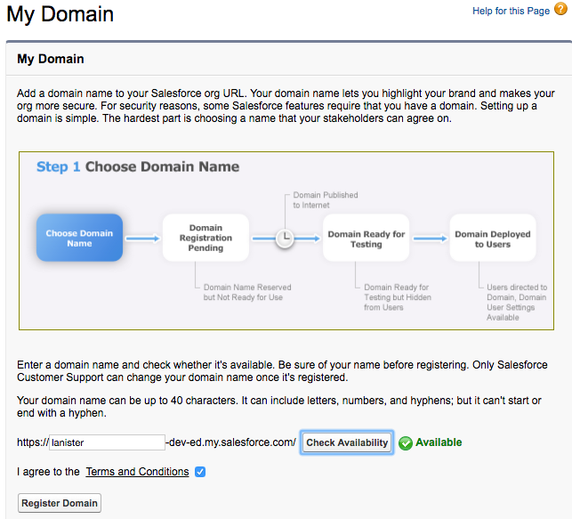
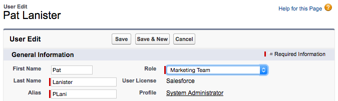
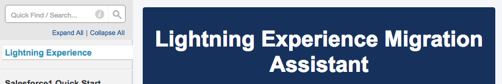
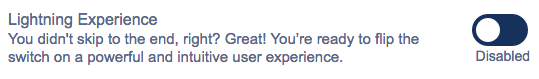

# Create the Salesforce Partner Community

This tutorial provides step by step instructions for setting up a Salesforce Developer Edition with a Partner Community for DocuSign development on Salesforce.

Setting up these accounts is free and no credit card is needed.

### Step 1. Create a Salesforce Developer Environment
* At [developer.salesforce.com](https://developer.salesforce.com), click the **Sign Up** button
* Fill in the form to get a *Developer Edition* of Salesforce (SFDC).
  Note that you can use any value for the *username* field that is not already in use. 
  
  Salesforce suggests using your email address as your username, but we suggest that you use a different value for your Salesforce Developer accounts. 
  
  You can have multiple usernames that use the same email address. For example, if your email is Larry@example.com, you could create multiple SFDC Developer environments, with usernames larry@ex.com, larry2@ex.com, etc
* Confirm your email address with SFDC and set your password
* Login to Salesforce at [login.salesforce.com(https://login.salesforce.com/)

### Step 2. Install DocuSign for Salesforce
* Goto the [AppExchange page for DocuSign on Salesforce](https://appexchange.salesforce.com/listingDetail?listingId=a0N30000001taX4EAI)
* Click **Log In** on the upper right corner of the page. Login with your new developer credentials.
* Click the **Get It Now** button on the page.
* Click the **Production** install button. It is used for Developer Edition accounts.
* Agree to the terms and click the **Confirm and Install** button to install DocuSign for Salesforce on your Developer Edition instance.
* Choose the **Install for all users** option. 

  The product supplies some resources that we'll be using but this tutorial does configure DocuSign for Salesforce. Use the [Administration Guide](https://10226ec94e53f4ca538f-0035e62ac0d194a46695a3b225d72cc8.ssl.cf2.rackcdn.com/docusign-for-salesforce-user-guide.pdf) to configure the product.

### Step 3. Configure the Developer Edition
* Create a custom domain for your instance: 
  * Click Setup
  * In the Quick find, type "my". Select **My Domain**
  * Enter any easy domain name in the form.
  * Agree to the terms and click **Register Domain**
  

* Assign a role to your own user name. Some operations can only be completed if the user has a role.
  * Click Setup
  * In the Quick find, type "users". Select **Administer / Users**
  * In the list of users, click the **Edit** link near your full name.
  * The User record for your entry will open in edit mode.
  * Choose a value for the **Role** entry. Which role you pick is not important.
  * Click Save
  

* Enable Lightning Experience
  * Click Setup
  * In the left navigation section, click **Lightning Experience**
  * The **Lightning Experience Migration Assistant** will open
  

  * Scroll down the page to the last item and **Enable** the **Lightning Experience**, Confirm via the popup.
  

  

  
   