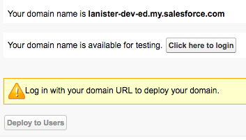
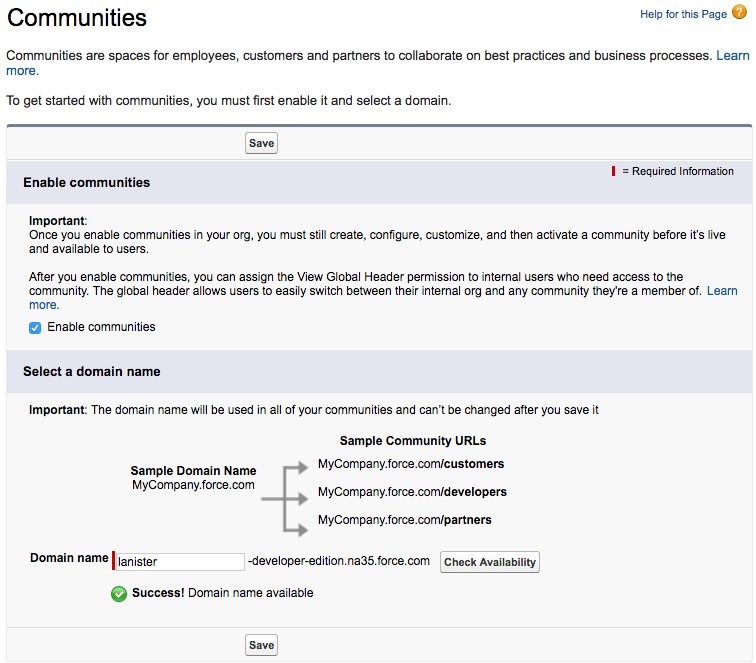
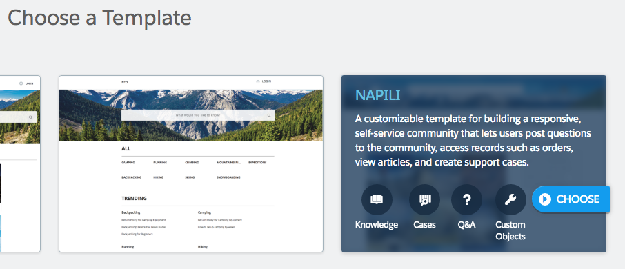
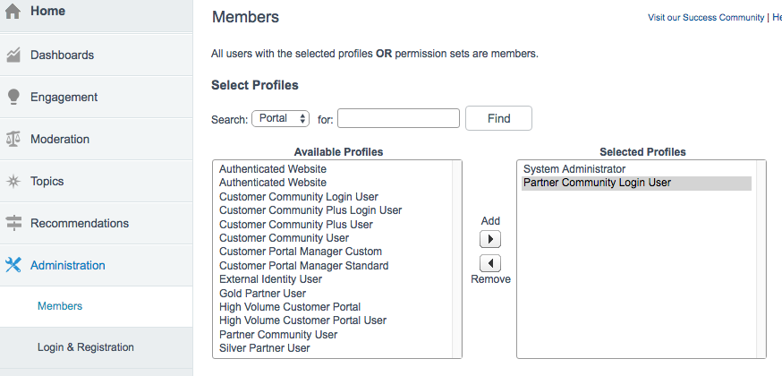
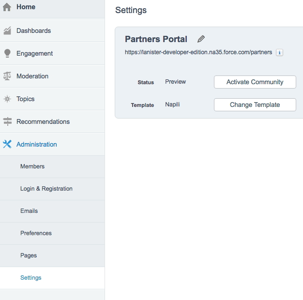
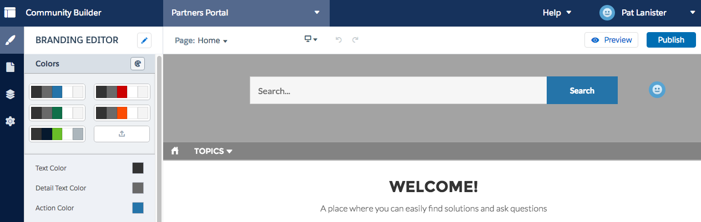
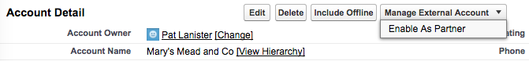
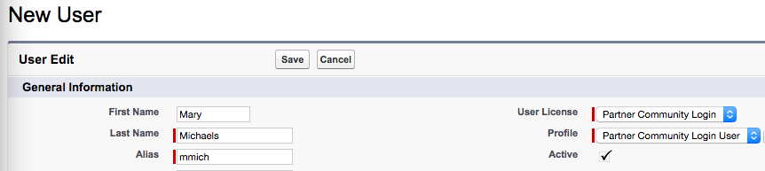
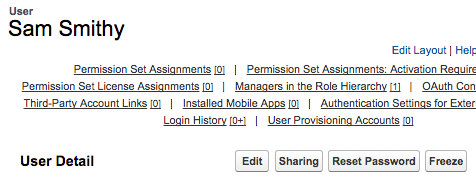

# Create the Salesforce Partner Community

This tutorial provides step by step instructions for setting up a Salesforce Developer Edition with a Partner Community for DocuSign development on Salesforce.

Setting up these accounts is free and no credit card is needed.

### Step 1. Create a Salesforce Developer Environment
* At [developer.salesforce.com](https://developer.salesforce.com), click the **Sign Up** button
* Fill in the form to get a *Developer Edition* of Salesforce (SFDC).
  Note that you can use any value for the *username* field that is not already in use. 
  
  Salesforce suggests using your email address as your username, but we suggest that you use a different value for your Salesforce Developer accounts. 
  
  You can have multiple usernames that use the same email address. For example, if your email is Larry@example.com, you could create multiple SFDC Developer environments, with usernames larry@ex.com, larry2@ex.com, etc
* Confirm your email address with SFDC and set your password
* Login to Salesforce at [login.salesforce.com](https://login.salesforce.com/)

### Step 2. Install DocuSign for Salesforce
* Goto the [AppExchange page for DocuSign on Salesforce](https://appexchange.salesforce.com/listingDetail?listingId=a0N30000001taX4EAI)
* Click **Log In** on the upper right corner of the page. Login with your new developer credentials.
* Click the **Get It Now** button on the page.
* Click the **Production** install button. It is used for Developer Edition accounts.
* Agree to the terms and click the **Confirm and Install** button to install DocuSign for Salesforce on your Developer Edition instance.
* Choose the **Install for all users** option. 

  The product automatically supplies some resources that we'll be using, so you do not need to configure it. 
  
  If you want to configure it and try it out, use the [Administration Guide](https://10226ec94e53f4ca538f-0035e62ac0d194a46695a3b225d72cc8.ssl.cf2.rackcdn.com/docusign-for-salesforce-user-guide.pdf).

### Step 3. Configure the Developer Edition

#### Create a custom domain for your instance: 
* Click Setup
* In the Quick find, type "my". Select **My Domain**
* Enter any easy domain name in the form.
* Agree to the terms and click **Register Domain**
  

#### Assign a role to your own user name. Some operations can only be completed if the user has a role.
* Click Setup
* In the Quick find, type "users". Select **Administer / Users**
* In the list of users, click the **Edit** link near your full name.
* The User record for your entry will open in edit mode.
* Choose a value for the **Role** entry. Which role you pick is not important.
* Click Save
  

#### Enable Lightning Experience
* Click Setup
* In the left navigation section, click **Lightning Experience**
* The **Lightning Experience Migration Assistant** will open
  

 
* Scroll down the page to the last item and **Enable** the **Lightning Experience**. Confirm via the popup.
  

#### Deploy your custom domain
By now, your custom domain has been created. Now you need to activate it.

* Click Setup
* In the Quick find, type "my". Select **My Domain**
* Click **Click here to login** You will be redirected back to the same page.
* Then click **Deploy to Users** and confirm

  
### Step 4. Set up your partner community

The [Salesforce Communities Implementation](http://resources.docs.salesforce.com/sfdc/pdf/salesforce_communities_implementation.pdf) guide can be used as a reference. In the following steps, page number references refer to pages in the implementation guide.

#### Enable Communities (page 10)
* From Setup, enter communities Settings in the Quick Find box, then select **Communities Settings**
* Select Enable communities.
* Select a domain name to use for your communities, then click Check Availability to make sure it’s not already being used.
* Click Save and confirm.

#### Create your partner community
* From the current page, or from Setup, enter communities Settings in the Quick Find box, then select **Communities**
* This page lists your communities. Click **New Community**
* You will see the "Choose a Template" page. Click the **Napili** template:
  
  
  
* Name your community. We recommend using a suffix on the url, eg "partners"
* Click **Create Community**
  
#### Add profiles to the community (page 19)
* Goto the Communities Management page: If you are in the community builder, use the drop-down menu near your name.
    
  
    
* If you are the main part of SFDC, from Setup, enter "all" in the Quick Find box, then select **All Communities**. Then click **Manage** next to your community's name
* Now that you're in the Community Management screen, Click **Administration** on the left, then **Members**

* In the **Select Profiles** section, change the **Search** choice to "Portal"
* Add the "Partner Community Login User" to the list of **Selected Profiles**
* Click **Save**
  
  

#### Activate the community
* Goto the Communities Management page: If you are in the community builder, use the drop-down menu near your name.    
* If you are the main part of SFDC, from Setup, enter "all" in the Quick Find box, then select **All Communities**. Then click **Manage** next to your community's name
* Now that you're in the Community Management screen, Click **Administration** on the left, then **Settings**
* Click **Activate Community** and confirm.
  
  

#### Publish the community's home page
* Goto the Community Builder Page for your portal: If you are in the community builder, use the drop-down menu near your name and choose **Go to Community Builder**
    
  
    
* If you are the main part of SFDC, from Setup, enter "all" in the Quick Find box, then select **All Communities**. Then click **Builder** next to your community's name 
  
* You will see the page builder tool, opened to the Home page. Click **Publish**
  
        
### Ready to test! Add an external user to your new partner portal
  * From the internal home page of SFDC, click on **Accounts*, then **New**
  * Create a new partner account. Only the partner's name is required.
  * Click **Save**

#### Set the account as a "Partner" account
* In the account detail page, use the **Manage External Account** dropdown menu and choose **Enable As Partner**. Confirm your choice.

* Note: the Manage External Account dropdown menu is not available in the Lightning Account Detail page.

#### Add a contact to the account and enable portal access
* In the **Account Detail** page, in the **Contacts** section, click **New Contact**
* Enter the new contact's information. Use an email address that you can receive mail from. 
* **Save** the contact
* In the **Contact Detail** page, use the **Manage External User** dropdown, and choose **Enable Partner User**
* You now see the **New User** page.
* Change the User License to **Partner Community Login**
* Click **Save**

* The new contact should automatically receive a welcome email with password setting instructions.

#### Send a password reset 
You can also manually send a password email by clicking **Reset Password** in the User's page.

