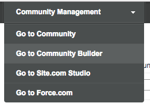
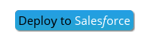

ver 1.1 package: https://login.salesforce.com/packaging/installPackage.apexp?p0=04t0Y000000YOkm

Chrome extension for managing multiple SFDC environments
https://chrome.google.com/webstore/detail/salesforce-logins-by-syne/mhpbcjokcjoldhjcapkcmfkkkgepapgm

New DE to try:
1. Nikita's:

2. larry4@ds.com / secret11 / spot

  

### Step 1. Install the managed package
* Login to SFDC with your Developer Environment (DE) credentials
* Goto the package [url](https://login.salesforce.com/packaging/installPackage.apexp?p0=04t0Y000000YOkm
) 
* Click **Install for All Users**
  

### Step 1. Alternate install from repo
* Goto the repo
* Click **Deploy to Salesforce**

  (addthe real button here!!)

  
  
* The next screen shows the repo information. Click **Login to Salesforce**

  

* Approve access to your Salesforce instance from the deploy tool: Click **Alow**
  
  
### Need to add the named credentials from scratch  
  

### Step 2. Configuring the Signing Objects Recipe

The package includes the recipe's SFDC objects, code, permission sets and other content.

#### Update the Named Credentials

* Setup. Type "named" in the quick find. Select **Named Credentials**
* You now see the **Named Credentials** screen
* Click **Edit** for the **DS_Demo_Integration_User** named credential
* You are now in the screen "Named Credential Edit: DS Demo Integration User"
* In the **Administration Username** and Password fields, enter your DocuSign credentials for either an account admin, or a user with XXX permissions. This user name is used to manage the embedded signing process.

  Each sending user will separately enter their own DocuSign credentials.
* In the **Callout Options** section of the page, change the checkboxes: **Only** the **Allow Merge Fields in HTTP Header** option should be checked. See the screenshot:
  
* Click **Save**

* After Saving your work, you are back at the list of the Named Credentials.
* Click **Edit** for the credential **DS Demo User**
* For this credential, **do not** enter an Administration Username or password
* In the **Callout Options** section of the page, change the checkboxes: **Only** the **Allow Merge Fields in HTTP Header** option should be checked. See the screenshot:
  
* Click **Save**

### Assign Permission Sets to the users

* Click Setup. Enter "users" in the quick find and select **Manage Users / Users**
* For each of the users who will be sending signing requests or signing them:
* Open their user record by clicking on their name.
* Goto the **Permission Set Assignments** section. 
  Note: Use the right Permission set section!
  
* Click **Edit Assigments**
* For senders: add **DocuSign Signing Recipe Sender** permissin. (Sender permission includes Signer permission)
* For signers: add **DocuSign Signing Recipe Signer** permission.
  

### Each Sender enters their own DocuSign credentials
* Click Setup. Type "users" in teh quick find box. Select **Manage Users / Users**
* Open a sender's record by clicking on their name
* Go to section **Authentication Settings for External Systems**
* Click **New**
* The screen "Authentication Settings for External Systems" is shown.
* Update the form:
  * Named Credential: DS Demo User (existing value)
  * User: Choose the user (admins can set the info for any user, regular users 
    only update their own information)
  * Enter the person's individual DocuSign account username and password
    
* Click **Save**

### Add account ID and Integration Key
* Click Settings. Enter "custom meta" in the quick find field. Choose **Custom Metadata Types**
* Click **Manage Records** for the **DocuSign Signing Recipe Integration** item
* Click **Edit** on the **Default** record
* Fill in the your DocuSign account ID and Integration Key
  Note that you must use the long form (guid) of your DocuSign Account ID, which is 
  available from the API section of the admin tool.
* Click *Save*

### Create a new Signing Request
* Switch to Lightning Experience to Send: use the *your name* menu > Switch to Lightning Experience
  
* Click the App Launcher icon
  
* Click the DocuSign Signing Recipe icon
  
* Click **Signing Requests* to open the records
* Click **New**
* The **Create Signing Request** modal opens
* Fill it in by entering a **Subject** and **Signer name** 
* The **Description** field is optional
* Click **Save**
  
* The envelope is created on DocuSign. When the envelope has been created, the 
  **Upload documents and send** button will be enabled. **Click** the button.
  
* You are redirected to DocuSign to add one or more documents to the envelope and to tag the documents. Within DocuSign, click **Send** when you've completed the envelope.
* You will be returned to the Salesforce system, to the Signing Request record. You can see that the record's status is now **Sent**
  

### Configure to enable Signer access

Open Community Builder

* Click on Page Editor (second on left) 
* Click on the nav bar (Topics) on the page, so you can edit it
* Click **Edit Navigation Menu** on right side
* Click **Add Menu Item**
  
* Fill in the form for the new item:
  * Name: Signing Requests
  * Type: Salesforce Object
  * Object Type: Signing Request
  * Default List View: Waiting for Signature
  * Publicly available: do NOT check.  
  * Click **Publish Changes**

Goto Page Manager (3rd icon)

*Click + Icon and choose **Create Object Pages**
  
* You'll see the **New Object Pages** modal window
* For Salesforce Objects, choose **Signing Request**  (not DocuSign Signing)
* Click **Create**
* You now see the *Signing Request* page
* Click on the **Signing Request Detail** link
  
* Your are now seeing the Signing Request Detail page. 
* Click **Edit** (top right corner)
* You're now seeing the page editor for the page.
* Click **Change Layout** on the right side
* Choose 2 columns with 2:1 ratio
  
* Click **Change**
* The page editor will be refeshed. You will need a wide browser window for this step.

### Add the component to the page

### #Note your community's url
* In **another** browser tab, open the main section of SFDC.
* Settings, enter "communities" in the Quick search box. Choose **All Communities**
* In the next step you will need your community's url. 

#### Add the Signing button component
* Switch back to your page editor, which is still open
* You will need a wide browser window for this step.
* On left, you see a list of components.
* Note the custom components section and the **Signing Request Sign Button**
* Note the **Add components to this region (Sidebar) section of the editor's main pane
  
* Drag the compnent to the sidebar region of the page
* The **Property Editor** is the right column of the editor
* In the Property Editor, Set the **Community URL** field to the url for the community from the other tab in your browser.
  Note: Copy the text from the All Communities screen, not the "link address"
  
#### Removing the status feed
By default, the Signing Request object detail screen includes a feed display about the record. The feed can be useful in development but may not be needed in production.

To remove it:

* Select the cpomponent for the detail record main section in the page editor
* In the component's properties change **Tab 3 Type** from **Feed** to **None**

#### Publish your changes
Click **Publish** (upper right corner)

### Change feed default to all updates
* Open Community Builder
* Open Page Editor. You're editing the home page
  
#### Add the feed component
Drag the **Feed** component to the page
If you receive an error such as the following, perform the next step.
  
* In the Property Editor for "Feed":
* Change Feed type to "My Feed"
* Click **Publish**

#### Remove the default feed component
* Click on the **MY FEED** tab item within the main section of the page editor
  
* The property editor will change to show "Featured Topics & Feeds" as the selected component. This is the default feed component for the community template.
* Delete the component by clcking on the x
  
* Click **Publish**

## A test: signing an envelope
* As the person that you sent the signing request to, log in to the community.
* You can login directly, or open the person's contact record and choose **Manage External User > Login to Community As User**
* In the community, click **Signing Requests** in the navigation bar
* You will see the list of signing requests.
* Click on the **Subject** of a signing request to open it.
  
* Click the **Sign with DocuSign** button. Depending on your screen width, the button may be on the right or bottom of the screen.
* You will be redirect to DocuSign for the signing ceremony.
* After you complete the signing ceremony, you'll be redirected back to Salesforce. 

 

## Problem using button?
See https://github.com/afawcett/githubsfdeploy/issues/25

## Uninstalling
Setup / installed packages

  
  
  

